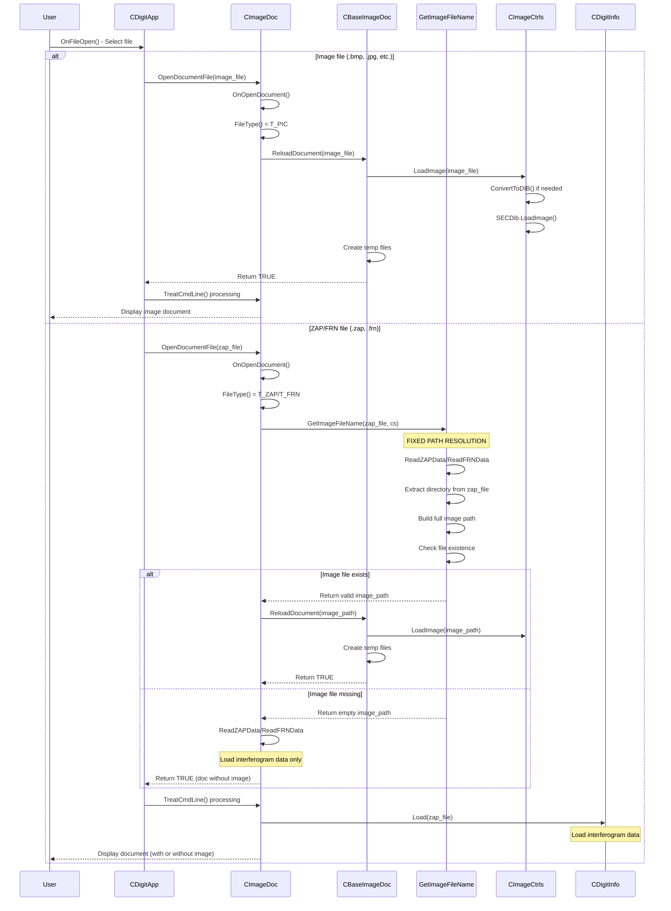
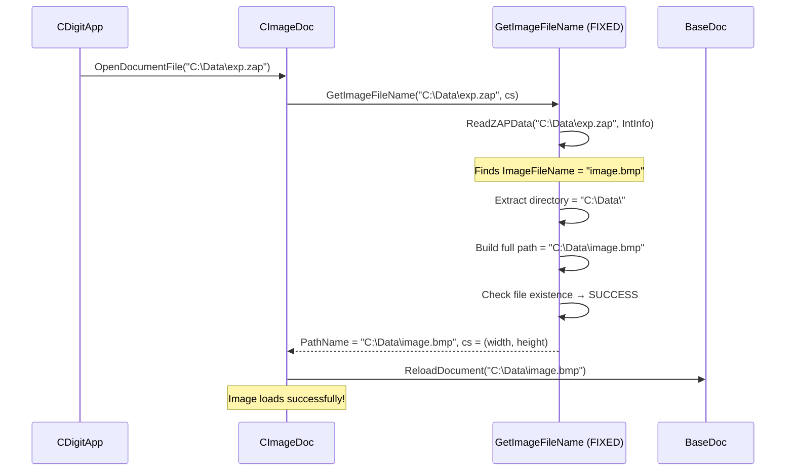

It's global issues ToDo - specific code issues are being marked 
'TODO: ...' withing code files, in VS one can view them in a 'Task List' (Ctrl+\,T) 

* **fixed:** (CImageCtrls::ConvertToDIB() creates temp for .bmp too) :
 loading .frn with ref to .bmp image causes the .bmp to be erazed on file close
* **fixed:** loading .zap/.frn using Recent Files List doesn't load fringes, image only
* design logic for placing the image relative to the sections in DOS .zap
* fix switching to '+' (add dot) on window's header click/focus restore
* file name must change after 'save as' otherwise it's 'save copy'
* show fringe number when hover over a dot or a fringe.
* undo for all the fringe manipulations
* allow moving dots in all the modes
* add line from the last dot to the cursor in '+' dot mode
* allow moving/transforming bounds while entering them or editing fringes
* allow moving image relative to the fringes/bound 
* make bounds' mode cross mark more contrast (red)
* 'apply' somtimes becomes inaccesible with a bound present
* allow few aperure masks, bound should be calculated as their outer limits
* scroll (grag) holding \<space\> key
* zoom with a mouse wheel and +/- keys
* break fringe (delete connection b/w dots)
* dots' vertical positions should not be restricted to the cut. 
  If some dot is moved outside its current cut new cut must be introduced.
  Maximum number of cuts corresponds to image's vertical resolution.
* review interferogramm loading logic (too vogue)
* ... should be added a lot here ...

### File loading logic (not clear enough)

