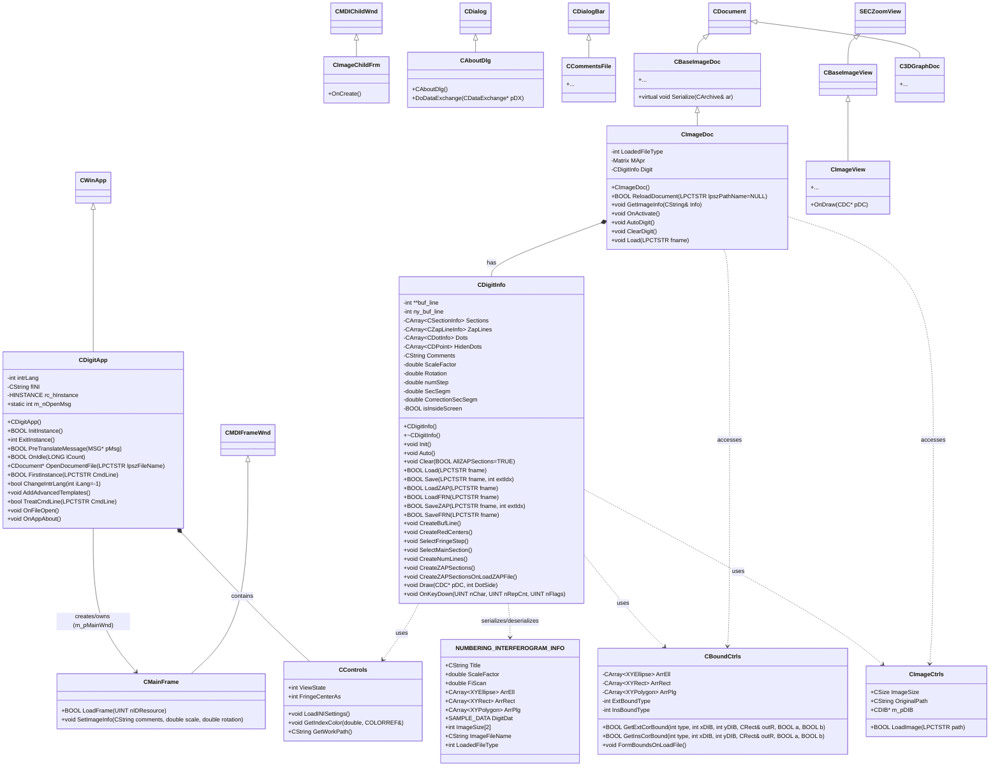

```mermaid

classDiagram
    class CSectionInfo {
      +CalcAveStep()
      +Form(int idx, unsigned char* line, int n, int ny, int** buf_line)
      +Sort()
      -CArray~CNumLine~ NumLines
      -CDLine L
      -double aveStep
    }

    class CDotInfo {
      +CDotInfo()
      +void Draw(CDC* pDC, int DotSide, COLORREF Color=RGB(0,0,0))
      -CDPoint P
      -double Number
      -int iZapSec
    }

    class CZapLineInfo {
      +CZapLineInfo()
      +void Draw(CDC* pDC)
      -CDLine L
      -int iSec
      -bool Removed
    }

    %% Примечание: вспомогательные/мелкие классы (CDIB, CNumLine, CDLine, CDPoint, SAMPLE_DATA и т.д.) опущены для краткости.