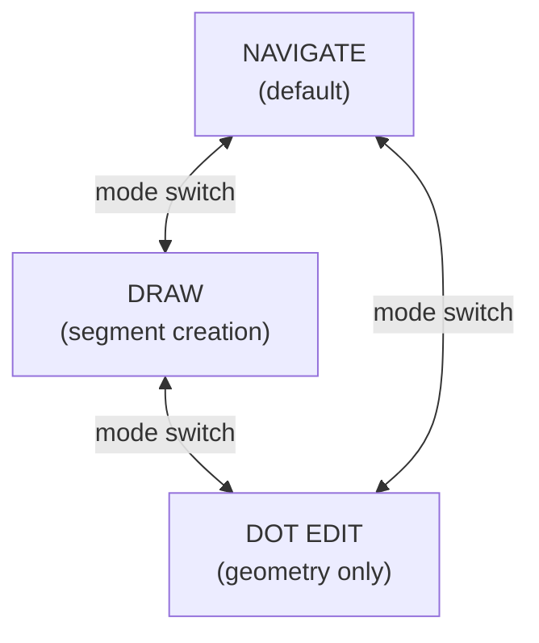
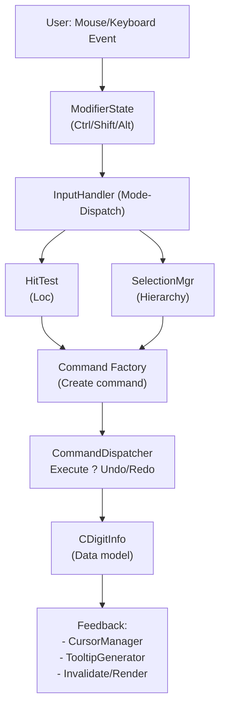

# Phase 2: Architecture Design for UX v1.0 (Segment-Primary Model)

**Status**: Complete architecture design for Digit/MFringe editor.  
**Date**: 2026-01-26  
**Purpose**: Map UX v1.0 concepts → Code architecture for implementation.  
**Audience**: Developers implementing interaction layer, command dispatch, and undo/redo.

**Model**: Segment-primary architecture. Fringes are logical groupings computed on-demand from segment Number values.

**Modernization**: Uses STL (`std::vector, std::string`) instead of MFC auxiliary types where possible.

---

## Overview

This document translates **UX v1.0 specification** into a working architecture that handles:
- Input handling (mode dispatch + modifier semantics)
- Selection management (persistent, hierarchical)
- Command execution (with undo/redo)
- Feedback (cursors, tooltips, state visualization)

**Key Principle**: Segments are the only geometric owners. Fringes are **computed groupings** by Number value.

**This is UX/architecture-level**, not a detailed implementation specification. Code details follow in Phase 3.

---

## Table of Contents

1. [A. Input Handler Architecture](#a-input-handler-architecture)
2. [B. Selection Management](#b-selection-management)
3. [C. Command Execution & Undo/Redo](#c-command-execution--undoredo)
4. [D. Cursor & Feedback](#d-cursor--feedback)
5. [E. Integration Point: ImageView](#e-integration-point-imageview)
6. [F. Data Flow Diagram](#f-data-flow-diagram)
7. [G. Class Diagram (Summary)](#g-class-diagram-summary)
8. [H. Key Design Constraints](#h-key-design-constraints)

---

## A. Input Handler Architecture

### A.1 Mode State Machine

Three modes, mutually exclusive, state-driven.



**Key Rules**:
- Only one mode active at a time
- Mode switch finalizes pending operations (e.g., end current segment when leaving Draw)
- Selection is **locked during Draw** mode

**Implementation Pattern:**

```cpp
enum class EditMode { Navigate, Draw, DotEdit };

class InputHandler {
    EditMode currentMode = EditMode::Navigate;
    
    void SetMode(EditMode newMode) {
        if (currentMode == EditMode::Draw) {
            // Finalize any active segment
            EndCurrentSegment();
        }
        currentMode = newMode;
        UpdateCursor();
    }
    
    EditMode GetMode() const { return currentMode; }
    bool IsInDrawMode() const { return currentMode == EditMode::Draw; }
};
```

---

### A.2 Modifier Dispatch (Context-Aware)

Each combination of **mode + modifier + click target** produces a specific behavior.

**Design Principle**: Same modifier has same semantic meaning across all modes.

- **Ctrl** = Add / Extend / Connect
- **Shift** = Range / Constrain / Promote  
- **Alt** = Alternate / Destructive / Structural

**Decision Tree Logic:**

```cpp
class ModifierDispatcher {
    
    // Mode: DRAW, Event: LeftClick
    void OnLeftClick(CPoint P, ModifierState mods, InputHandler& handler) {
        if (mods.None()) {
            if (IsEmpty(P)) 
                StartNewSegment(P);
            else if (IsSegmentEnd(P)) 
                ContinueSegment(P);
        }
        else if (mods.Ctrl()) {
            if (IsSegmentEnd(P)) 
                ConnectSegments(P);  // ← Free end becomes active
        }
        else if (mods.Alt()) {
            if (IsDot(P)) 
                DeleteDot(P);
        }
    }
    
    // Mode: NAVIGATE, Event: LeftClick
    void OnLeftClickNavigate(CPoint P, ModifierState mods, SelectionManager& sel) {
        if (mods.None()) 
            sel.SelectSingle(P);
        else if (mods.Ctrl()) 
            sel.AddToSelection(P);
        else if (mods.Shift()) 
            sel.RangeSelect(P);
    }
    
    // Mode: DOT_EDIT, Event: LeftClick
    void OnLeftClickDotEdit(CPoint P, ModifierState mods) {
        if (mods.None()) {
            if (IsEdge(P)) InsertDotOnEdge(P);
            else if (IsDot(P)) SelectDot(P);
        }
        else if (mods.Alt()) {
            if (IsDot(P)) DeleteDot(P);
        }
    }
};
```

### A.3 Modifier State Struct

```cpp
struct ModifierState {
    bool ctrl = false;
    bool shift = false;
    bool alt = false;
    
    bool None() const { return !ctrl && !shift && !alt; }
    
    static ModifierState FromKeyboard() {
        return {
            (GetKeyState(VK_CONTROL) & 0x8000) != 0,
            (GetKeyState(VK_SHIFT) & 0x8000) != 0,
            (GetKeyState(VK_MENU) & 0x8000) != 0
        };
    }
    
    std::string Debug() const {
        std::string s;
        if (ctrl) s += "Ctrl+";
        if (shift) s += "Shift+";
        if (alt) s += "Alt+";
        return s.empty() ? "None" : s;
    }
};
```

---

## B. Selection Management

### B.1 Hierarchical Selection State

**Selection is persistent**: survives mode switches.  
**Selection is hierarchical**: Dot → Edge → Segment → Fringe.  
**Selection is explicit**: no implicit promotion.

```cpp
enum class SelectionLevel { None, Dot, Edge, Segment, Fringe };

class SelectionManager {
public:
    struct SelectedObject {
        SelectionLevel level = SelectionLevel::None;
        int iSegment = -1;  // Index into segments array
        int iDot = -1;
        int iEdge = -1;     // Edge index: pair (dot[i], dot[i+1])
        double Number = 0.0; // For Fringe-level selection
        
        bool IsValid() const { return level != SelectionLevel::None; }
        bool IsSameLevel(const SelectedObject& other) const {
            return level == other.level;
        }
    };
    
private:
    std::vector<SelectedObject> selection;
    
public:
    // ===== Selection Primitives =====
    
    void SelectDot(int iSegment, int iDot) {
        selection.clear();
        SelectedObject obj;
        obj.level = SelectionLevel::Dot;
        obj.iSegment = iSegment;
        obj.iDot = iDot;
        selection.push_back(obj);
    }
    
    void SelectEdge(int iSegment, int iEdge) {
        selection.clear();
        SelectedObject obj;
        obj.level = SelectionLevel::Edge;
        obj.iSegment = iSegment;
        obj.iEdge = iEdge;  // Edge between dot[iE] and dot[iE+1]
        selection.push_back(obj);
    }
    
    void SelectSegment(int iSegment) {
        selection.clear();
        SelectedObject obj;
        obj.level = SelectionLevel::Segment;
        obj.iSegment = iSegment;
        selection.push_back(obj);
    }
    
    void SelectFringe(double number) {
        selection.clear();
        // Select ALL segments with this Number
        for (int iSeg = 0; iSeg < segments.size(); iSeg++) {
            if (std::abs(segments[iSeg].GetNumber() - number) < EPSILON) {
                SelectedObject obj;
                obj.level = SelectionLevel::Fringe;
                obj.iSegment = iSeg;
                obj.Number = number;
                selection.push_back(obj);
            }
        }
    }
    
    // ===== Multi-Selection =====
    
    bool AddToSelection(const SelectedObject& obj) {
        // Only add if same level as existing selection
        if (!selection.empty()) {
            if (!selection[0].IsSameLevel(obj)) {
                return false;  // Incompatible level
            }
            // Avoid duplicates
            auto it = std::find_if(selection.begin(), selection.end(),
                [&obj](const SelectedObject& s) { 
                    return s.iSegment == obj.iSegment && 
                           s.iDot == obj.iDot && 
                           s.level == obj.level; 
                });
            if (it != selection.end()) {
                selection.erase(it);  // Toggle
                return true;
            }
        }
        selection.push_back(obj);
        return true;
    }
    
    // ===== Promotion =====
    
    void PromoteToFringe() {
        // Collect unique Numbers from current selection
        std::set<double> numbers;
        for (const auto& obj : selection) {
            double num = segments[obj.iSegment].GetNumber();
            numbers.insert(num);
        }
        
        selection.clear();
        // For each unique Number, select all segments with that Number
        for (double num : numbers) {
            SelectFringe(num);  // Adds all matching segments
        }
    }
    
    // ===== Queries =====
    
    SelectionLevel GetLevel() const {
        if (selection.empty()) return SelectionLevel::None;
        return selection[0].level;
    }
    
    size_t GetCount() const { return selection.size(); }
    
    const SelectedObject& GetAt(size_t i) const { return selection[i]; }
    
    void Clear() { selection.clear(); }
    
    bool IsEmpty() const { return selection.empty(); }
};
```

### B.2 Hit Testing (Selection Query)

```cpp
class HitTester {
    static constexpr int HIT_TOLERANCE = 5;  // pixels
    
    // ===== Main Entry Point =====
    
    SelectionLevel HitTest(CPoint P, int& outSegment, int& outDot) {
        // Priority: Dot > Edge > Segment > Fringe > Nothing
        
        // Iterate segments in reverse (top to bottom z-order)
        for (int iSeg = static_cast<int>(segments.size()) - 1; iSeg >= 0; iSeg--) {
            
            // 1. Check dots (highest priority)
            for (int iD = 0; iD < segments[iSeg].DotCount(); iD++) {
                if (DotDistance(P, segments[iSeg].GetDot(iD)) < HIT_TOLERANCE) {
                    outSegment = iSeg;
                    outDot = iD;
                    return SelectionLevel::Dot;
                }
            }
            
            // 2. Check edges
            for (int iE = 0; iE < segments[iSeg].DotCount() - 1; iE++) {
                double dist = DistanceToSegment(P, 
                    segments[iSeg].GetDot(iE), 
                    segments[iSeg].GetDot(iE + 1));
                if (dist < HIT_TOLERANCE) {
                    outSegment = iSeg;
                    outDot = iE;  // Edge start index
                    return SelectionLevel::Edge;
                }
            }
        }
        
        return SelectionLevel::None;
    }
    
    // ===== Helper Methods =====
    
    double DotDistance(CPoint P, CDPoint dot) const {
        double dx = P.x - dot.x;
        double dy = P.y - dot.y;
        return sqrt(dx*dx + dy*dy);
    }
    
    double DistanceToSegment(CPoint P, CDPoint A, CDPoint B) const {
        double ABx = B.x - A.x;
        double ABy = B.y - A.y;
        double APx = P.x - A.x;
        double APy = P.y - A.y;
        
        double dotProduct = APx * ABx + APy * ABy;
        double lenSq = ABx * ABx + ABy * ABy;
        
        double t = (lenSq > 0) ? dotProduct / lenSq : 0;
        t = std::max(0.0, std::min(1.0, t));
        
        double closestX = A.x + t * ABx;
        double closestY = A.y + t * ABy;
        
        double dx = P.x - closestX;
        double dy = P.y - closestY;
        return sqrt(dx*dx + dy*dy);
    }
};
```

---

## C. Command Execution & Undo/Redo

### C.1 Command Base Class

```cpp
class Command {
public:
    virtual void Execute() = 0;
    virtual void Undo() = 0;
    virtual void Redo() { Execute(); }  // Default: redo = execute
    virtual std::string GetName() const { return "Command"; }  // For debugging
    virtual ~Command() = default;
};
```

### C.2 Command Examples (UX v1.0 Frozen)

```cpp
// ===== Drawing Commands =====

class AddDotCommand : public Command {
    int iSegment, iDot;
    CDPoint point;
    CDigitInfo* pDigit;
    
public:
    AddDotCommand(CDigitInfo* pD, int iSeg, int iDot_idx, CDPoint p)
        : pDigit(pD), iSegment(iSeg), iDot(iDot_idx), point(p) {}
    
    void Execute() override {
        pDigit->InsertDot(iSegment, iDot, point);
    }
    
    void Undo() override {
        pDigit->RemoveDot(iSegment, iDot);
    }
    
    std::string GetName() const override { return "Add Dot"; }
};

class RemoveLastDotCommand : public Command {
    int iSegment, iDot;
    CDPoint savedPoint;
    CDigitInfo* pDigit;
    
public:
    RemoveLastDotCommand(CDigitInfo* pD) : pDigit(pD) {
        // Save state before removal
        pD->GetLastDot(iSegment, iDot, savedPoint);
    }
    
    void Execute() override {
        pDigit->RemoveDot(iSegment, iDot);
    }
    
    void Undo() override {
        pDigit->InsertDot(iSegment, iDot, savedPoint);
    }
    
    std::string GetName() const override { return "Remove Dot"; }
};

// ===== Geometry Editing Commands =====

class MoveGeometryCommand : public Command {
    std::vector<int> affectedSegments, affectedDots;
    std::vector<CDPoint> oldPositions;
    std::vector<CDPoint> newPositions;
    CDigitInfo* pDigit;
    
public:
    MoveGeometryCommand(CDigitInfo* pD) : pDigit(pD) {}
    
    void AddPoint(int iSeg, int iD, CDPoint oldPos, CDPoint newPos) {
        affectedSegments.push_back(iSeg);
        affectedDots.push_back(iD);
        oldPositions.push_back(oldPos);
        newPositions.push_back(newPos);
    }
    
    void Execute() override {
        for (size_t i = 0; i < affectedSegments.size(); i++) {
            pDigit->SetDotPosition(affectedSegments[i], affectedDots[i], newPositions[i]);
        }
    }
    
    void Undo() override {
        for (size_t i = 0; i < affectedSegments.size(); i++) {
            pDigit->SetDotPosition(affectedSegments[i], affectedDots[i], oldPositions[i]);
        }
    }
    
    std::string GetName() const override { return "Move Geometry"; }
};

// ===== Selection-Based Commands =====

class RenumberCommand : public Command {
    std::vector<int> affectedSegments;  // Segment indices
    std::vector<double> oldNumbers;
    double newNumber;
    CDigitInfo* pDigit;
    
public:
    RenumberCommand(CDigitInfo* pD, const std::vector<int>& segments, double newNum)
        : pDigit(pD), affectedSegments(segments), newNumber(newNum) {
        // Save old numbers
        for (int iSeg : segments) {
            oldNumbers.push_back(pD->GetSegment(iSeg).GetNumber());
        }
    }
    
    void Execute() override {
        for (int iSeg : affectedSegments) {
            pDigit->SetSegmentNumber(iSeg, newNumber);
        }
        // Note: This changes which fringe the segment belongs to!
    }
    
    void Undo() override {
        for (size_t i = 0; i < affectedSegments.size(); i++) {
            pDigit->SetSegmentNumber(affectedSegments[i], oldNumbers[i]);
        }
    }
    
    std::string GetName() const override { return "Renumber Segment"; }
};

class SimplifyCommand : public Command {
    int iSegment;
    std::vector<CDPoint> originalPoints;
    double epsilon;
    CDigitInfo* pDigit;
    
public:
    SimplifyCommand(CDigitInfo* pD, int iSeg, double eps)
        : pDigit(pD), iSegment(iSeg), epsilon(eps) {
        // Save original points
        pD->GetSegmentPoints(iSeg, originalPoints);
    }
    
    void Execute() override {
        pDigit->SimplifySegment(iSegment, epsilon);
    }
    
    void Undo() override {
        pDigit->SetSegmentPoints(iSegment, originalPoints);
    }
    
    std::string GetName() const override { return "Simplify"; }
};

class DeleteSelectionCommand : public Command {
    // Saves entire deleted objects for undo
    std::vector<int> deletedSegments;  // Indices
    std::vector<CFringeSegment> savedSegments;
    CDigitInfo* pDigit;
    
public:
    DeleteSelectionCommand(CDigitInfo* pD, const SelectionManager& sel)
        : pDigit(pD) {
        // Collect segments to delete from selection
        // If Fringe-level, delete all segments with same Number
        // ...
    }
    
    void Execute() override {
        for (int i = static_cast<int>(deletedSegments.size()) - 1; i >= 0; i--) {
            pDigit->DeleteSegment(deletedSegments[i]);
        }
    }
    
    void Undo() override {
        for (size_t i = 0; i < deletedSegments.size(); i++) {
            pDigit->InsertSegment(deletedSegments[i], savedSegments[i]);
        }
    }
    
    std::string GetName() const override { return "Delete"; }
};
```

### C.3 Command Dispatcher

```cpp
class CommandDispatcher {
    std::vector<std::unique_ptr<Command>> undoStack;
    std::vector<std::unique_ptr<Command>> redoStack;
    
public:
    ~CommandDispatcher() = default;  // unique_ptr handles cleanup
    
    // ===== Core Operations =====
    
    void Execute(std::unique_ptr<Command> cmd) {
        assert(cmd != nullptr);
        cmd->Execute();
        undoStack.push_back(std::move(cmd));
        
        // Clear redo stack (new command breaks redo chain)
        redoStack.clear();
        
        OnStateChanged();
    }
    
    void Undo() {
        if (undoStack.empty()) return;
        
        Command* cmd = undoStack.back().get();
        cmd->Undo();
        
        redoStack.push_back(std::move(undoStack.back()));
        undoStack.pop_back();
        
        OnStateChanged();
    }
    
    void Redo() {
        if (redoStack.empty()) return;
        
        Command* cmd = redoStack.back().get();
        cmd->Redo();
        
        undoStack.push_back(std::move(redoStack.back()));
        redoStack.pop_back();
        
        OnStateChanged();
    }
    
    // ===== State Queries =====
    
    bool CanUndo() const { return !undoStack.empty(); }
    bool CanRedo() const { return !redoStack.empty(); }
    
    std::string GetUndoLabel() const {
        if (undoStack.empty()) return "Undo";
        Command* cmd = undoStack.back().get();
        return "Undo " + cmd->GetName();
    }
    
    std::string GetRedoLabel() const {
        if (redoStack.empty()) return "Redo";
        Command* cmd = redoStack.back().get();
        return "Redo " + cmd->GetName();
    }
    
private:
    void OnStateChanged() {
        // Notify UI to update undo/redo buttons
        // (Call parent view's Invalidate, update menu, etc.)
    }
};
```

---

## D. Cursor & Feedback

### D.1 Cursor State Machine

**Base cursor** = Mode icon.  
**Overlay** = Modifier feedback.

```cpp
enum class CursorType {
    Arrow,        // Navigate mode
    Crosshair,    // Draw mode
    Vertex,       // Dot Edit mode
    Wait,         // Processing
};

enum class CursorOverlay {
    None,
    Plus,         // Ctrl (add/connect)
    Range,        // Shift (range/constrain)
    Bang,         // Alt (destructive)
};

class CursorManager {
    HCURSOR hCursorArrow, hCursorCrosshair, hCursorVertex, hCursorWait;
    
public:
    CursorManager() {
        // Load cursor resources
        hCursorArrow = ::LoadCursor(NULL, IDC_ARROW);
        hCursorCrosshair = ::LoadCursor(NULL, IDC_CROSS);
        // hCursorVertex = ::LoadCursor(hInstance, IDC_CUSTOM_VERTEX);
        hCursorWait = ::LoadCursor(NULL, IDC_WAIT);
    }
    
    void UpdateCursor(EditMode mode, ModifierState mods, SelectionLevel under) {
        CursorType base;
        CursorOverlay overlay = CursorOverlay::None;
        
        // 1. Base cursor by mode
        switch (mode) {
            case EditMode::Navigate:  base = CursorType::Arrow; break;
            case EditMode::Draw:      base = CursorType::Crosshair; break;
            case EditMode::DotEdit:   base = CursorType::Vertex; break;
        }
        
        // 2. Overlay by modifier
        if (mods.ctrl)       overlay = CursorOverlay::Plus;
        else if (mods.shift) overlay = CursorOverlay::Range;
        else if (mods.alt)   overlay = CursorOverlay::Bang;
        
        // 3. Compose and set cursor
        SetCursorImage(base, overlay);
    }
    
private:
    void SetCursorImage(CursorType base, CursorOverlay overlay) {
        // Composite cursor from base + overlay
        // For now, just set base; overlay could be implemented with 
        // custom cursor resources or by drawing overlay at click time
        
        HCURSOR hCursor;
        switch (base) {
            case CursorType::Arrow:      hCursor = hCursorArrow; break;
            case CursorType::Crosshair:  hCursor = hCursorCrosshair; break;
            case CursorType::Vertex:     hCursor = hCursorVertex; break;
            case CursorType::Wait:       hCursor = hCursorWait; break;
        }
        
        ::SetCursor(hCursor);
    }
};
```

### D.2 Tooltip Generator

```cpp
class TooltipGenerator {
    static constexpr int MAX_TOOLTIP_LEN = 256;
    
    std::string GetTooltip(const SelectionManager::SelectedObject& obj, 
                           const CDigitInfo& digit) {
        char buffer[MAX_TOOLTIP_LEN];
        
        switch (obj.level) {
            case SelectionLevel::Dot: {
                const CFringeSegment& segment = digit.GetSegment(obj.iSegment);
                double number = segment.GetNumber();
                
                // Count segments in this fringe
                int segCountInFringe = digit.GetSegmentCountForNumber(number);
                int segIndexInFringe = digit.GetSegmentIndexInFringe(obj.iSegment);
                int dotCount = segment.DotCount();
                
                sprintf_s(buffer, "#%.1f / %d(%d) / %d", 
                    number, segIndexInFringe + 1, segCountInFringe, obj.iDot + 1);
                break;
            }
            case SelectionLevel::Edge: {
                const CFringeSegment& segment = digit.GetSegment(obj.iSegment);
                double number = segment.GetNumber();
                int dotCount = segment.DotCount();
                
                sprintf_s(buffer, "#%.1f Edge (%d–%d of %d)", 
                    number, obj.iEdge, obj.iEdge + 1, dotCount - 1);
                break;
            }
            case SelectionLevel::Segment: {
                const CFringeSegment& segment = digit.GetSegment(obj.iSegment);
                int dotCount = segment.DotCount();
                double number = segment.GetNumber();
                
                sprintf_s(buffer, "Fringe #%.1f Segment — %d dots", number, dotCount);
                break;
            }
            case SelectionLevel::Fringe: {
                double number = obj.Number;
                int segCount = digit.GetSegmentCountForNumber(number);
                
                sprintf_s(buffer, "Fringe #%.1f (%d segments)", number, segCount);
                break;
            }
            default:
                strcpy_s(buffer, "Unknown");
                break;
        }
        
        return std::string(buffer);
    }
};
```

---

## E. Integration Point: ImageView

### E.1 Input Routing (Existing ImageView → InputHandler)

This shows how the architecture components wire together in the existing `CImageView` class.

```cpp
// In ImageView.cpp
class CImageView : public CBaseImageView {
    
private:
    InputHandler inputHandler;
    SelectionManager selectionMgr;
    HitTester hitTester;
    CommandDispatcher cmdDispatcher;
    CursorManager cursorMgr;
    TooltipGenerator tooltipGen;
    
    // State
    EditMode currentMode = EditMode::Navigate;
    CPoint lastMousePos;
    
    // During-drag state (for move geometry)
    bool bDragging = false;
    CPoint dragStart;
    std::unique_ptr<MoveGeometryCommand> pMoveCmd;
    
public:
    
    // ===== Mode Switching =====
    
    void SetEditMode(EditMode newMode) {
        if (currentMode == EditMode::Draw && newMode != EditMode::Draw) {
            inputHandler.EndCurrentSegment();
        }
        currentMode = newMode;
        inputHandler.SetMode(newMode);
        Invalidate(FALSE);
    }
    
    // ===== Mouse Events =====
    
    afx_msg void OnLButtonDown(UINT nFlags, CPoint point) {
        ModifierState mods = ModifierState::FromKeyboard();
        
        int iSegment, iDot;
        SelectionLevel hitLevel = hitTester.HitTest(point, iSegment, iDot);
        
        if (currentMode == EditMode::Navigate) {
            OnLButtonDownNavigate(point, mods, hitLevel, iSegment, iDot);
        }
        else if (currentMode == EditMode::Draw) {
            OnLButtonDownDraw(point, mods, hitLevel, iSegment, iDot);
        }
        else if (currentMode == EditMode::DotEdit) {
            OnLButtonDownDotEdit(point, mods, hitLevel, iSegment, iDot);
        }
        
        Invalidate(FALSE);
    }
    
    afx_msg void OnLButtonUp(UINT nFlags, CPoint point) {
        if (bDragging && pMoveCmd) {
            cmdDispatcher.Execute(std::move(pMoveCmd));
        }
        bDragging = false;
        Invalidate(FALSE);
    }
    
    afx_msg void OnMouseMove(UINT nFlags, CPoint point) {
        ModifierState mods = ModifierState::FromKeyboard();
        
        // 1. Handle dragging (for geometry move)
        if (bDragging && pMoveCmd) {
            CPoint delta = point - dragStart;
            // Update move command with new positions
            // (Would need to refactor MoveGeometryCommand to support preview)
        }
        
        // 2. Update cursor feedback
        int iSegment, iDot;
        SelectionLevel hitLevel = hitTester.HitTest(point, iSegment, iDot);
        cursorMgr.UpdateCursor(currentMode, mods, hitLevel);
        
        // 3. Update tooltip
        if (hitLevel != SelectionLevel::None) {
            SelectionManager::SelectedObject obj;
            obj.level = hitLevel;
            obj.iSegment = iSegment;
            obj.iDot = iDot;
            
            std::string tip = tooltipGen.GetTooltip(obj, digitInfo);
            // Convert to Windows API if needed: SetToolTip(tip.c_str());
        }
        else {
            // SetToolTip("");
        }
        
        lastMousePos = point;
        Invalidate(FALSE);
    }
    
    afx_msg void OnRButtonDown(UINT nFlags, CPoint point) {
        if (currentMode == EditMode::Draw) {
            // End current segment
            inputHandler.EndCurrentSegment();
        }
        else {
            // Show context menu
            OnContextMenu(point);
        }
        Invalidate(FALSE);
    }
    
    // ===== Keyboard Events =====
    
    afx_msg void OnKeyDown(UINT nChar, UINT nRepCnt, UINT nFlags) {
        switch (nChar) {
            case VK_DELETE:
                OnKeyDelete();
                break;
            case VK_OEM_PLUS:
            case '+':
                OnKeyNumberIncrement();
                break;
            case VK_OEM_MINUS:
            case '-':
                OnKeyNumberDecrement();
                break;
            case 'S':
                OnKeySimplify();
                break;
            case VK_BACK:
                if (currentMode == EditMode::Draw) {
                    OnKeyRemoveLastDot();
                }
                break;
            case VK_ESCAPE:
                if (currentMode == EditMode::Draw) {
                    inputHandler.EndCurrentSegment();
                }
                selectionMgr.Clear();
                Invalidate(FALSE);
                break;
            case VK_TAB:
                OnKeyCycleSelection();
                break;
        }
    }
    
    // ===== Command Handlers (from Keyboard / Menu) =====
    
private:
    
    void OnKeyDelete() {
        // Create and execute delete command
        DeleteSelectionCommand* pCmd = new DeleteSelectionCommand(&digitInfo, selectionMgr);
        cmdDispatcher.Execute(pCmd);
        selectionMgr.Clear();
    }
    
    void OnKeyNumberIncrement() {
        if (selectionMgr.GetLevel() == SelectionLevel::Fringe ||
            selectionMgr.GetLevel() == SelectionLevel::Segment) {
            
            // Collect affected segments
            std::vector<int> segments;
            for (size_t i = 0; i < selectionMgr.GetCount(); i++) {
                segments.push_back(selectionMgr.GetAt(i).iSegment);
            }
            
            double currentNum = digitInfo.GetSegment(segments[0]).GetNumber();
            double step = digitInfo.GetNumberStep();
            
            auto pCmd = std::make_unique<RenumberCommand>(&digitInfo, segments, currentNum + step);
            cmdDispatcher.Execute(std::move(pCmd));
        }
    }
    
    void OnKeyNumberDecrement() {
        if (selectionMgr.GetLevel() == SelectionLevel::Fringe ||
            selectionMgr.GetLevel() == SelectionLevel::Segment) {
            
            std::vector<int> segments;
            for (size_t i = 0; i < selectionMgr.GetCount(); i++) {
                segments.push_back(selectionMgr.GetAt(i).iSegment);
            }
            
            double currentNum = digitInfo.GetSegment(segments[0]).GetNumber();
            double step = digitInfo.GetNumberStep();
            
            auto pCmd = std::make_unique<RenumberCommand>(&digitInfo, segments, currentNum - step);
            cmdDispatcher.Execute(std::move(pCmd));
        }
    }
    
    void OnKeySimplify() {
        if (selectionMgr.GetLevel() == SelectionLevel::Segment) {
            for (size_t i = 0; i < selectionMgr.GetCount(); i++) {
                const auto& obj = selectionMgr.GetAt(i);
                SimplifyCommand* pCmd = new SimplifyCommand(&digitInfo, obj.iSegment, 1.0);
                cmdDispatcher.Execute(pCmd);
            }
        }
    }
    
    void OnKeyRemoveLastDot() {
        RemoveLastDotCommand* pCmd = new RemoveLastDotCommand(&digitInfo);
        cmdDispatcher.Execute(pCmd);
    }
    
    void OnKeyCycleSelection() {
        // Navigate to next object of same level, or cycle level
        // ...
    }
    
    // ===== Mode-Specific Handlers =====
    
    void OnLButtonDownNavigate(CPoint P, ModifierState mods, SelectionLevel hitLevel,
                               int iSegment, int iDot) {
        SelectionManager::SelectedObject obj;
        
        if (hitLevel == SelectionLevel::None) {
            // Click on empty space
            if (mods.None()) {
                selectionMgr.Clear();
            }
        }
        else {
            // Click on object
            obj.iSegment = iSegment;
            obj.iDot = iDot;
            obj.level = hitLevel;
            
            if (mods.None()) {
                selectionMgr.SelectDot(iSegment, iDot);
            }
            else if (mods.Ctrl()) {
                selectionMgr.AddToSelection(obj);
            }
            else if (mods.Shift()) {
                // Range select within same fringe/curve
                // ...
            }
            else if (mods.Alt()) {
                selectionMgr.SelectFringe(iSegment);
            }
        }
    }
    
    void OnLButtonDownDraw(CPoint P, ModifierState mods, SelectionLevel hitLevel,
                           int iSegment, int iDot) {
        if (mods.None()) {
            if (hitLevel == SelectionLevel::None) {
                // Start new segment
                inputHandler.StartNewSegment(P);
            }
            else if (hitLevel == SelectionLevel::Dot) {
                // Continue from segment end
                inputHandler.ContinueSegment(iSegment, iDot);
            }
        }
        else if (mods.Ctrl() && hitLevel == SelectionLevel::Dot) {
            // Connect segments
            inputHandler.ConnectCurves(iSegment, iDot);
        }
        else if (mods.Alt() && hitLevel == SelectionLevel::Dot) {
            // Delete dot
            DeleteSelectionCommand* pCmd = new DeleteSelectionCommand(&digitInfo, selectionMgr);
            cmdDispatcher.Execute(pCmd);
        }
    }
    
    void OnLButtonDownDotEdit(CPoint P, ModifierState mods, SelectionLevel hitLevel,
                              int iSegment, int iDot) {
        if (hitLevel == SelectionLevel::Dot) {
            if (mods.Alt()) {
                // Delete dot
                // ...
            }
            else {
                // Start drag to move
                bDragging = true;
                dragStart = P;
                pMoveCmd = std::make_unique<MoveGeometryCommand>(&digitInfo);
                pMoveCmd->AddPoint(iSegment, iDot, digitInfo.GetDotPosition(iSegment, iDot), P);
            }
        }
        else if (hitLevel == SelectionLevel::Edge) {
            // Insert dot on edge
            // ...
        }
    }
};
```

---

## F. Data Flow Diagram



---

## G. Class Diagram (Summary)

```## G. Class Diagram (Summary)

InputHandler
├── SetMode(EditMode)
├── OnMouseDown(point, mods)
├── OnMouseMove(point, mods)
├── StartNewSegment(P)
├── ContinueSegment(iSegment, iDot)
├── ConnectSegments(iSegment, iDot)
├── EndCurrentSegment()
└── IsInDrawMode() → bool

SelectionManager
├── SelectDot(iSeg, iD)
├── SelectSegment(iSeg)
├── AddToSelection(obj)
├── PromoteToFringe()
├── GetLevel() → SelectionLevel
├── GetCount() → int
├── GetAt(i) → SelectionObject
└── Clear()

HitTester
├── HitTest(P) → SelectionLevel
├── DotDistance(P, dot) → float
└── DistanceToSegment(P, A, B) → float

CommandDispatcher
├── Execute(Command*)
├── Undo()
├── Redo()
├── CanUndo() → bool
├── CanRedo() → bool
├── GetUndoLabel() → string
└── GetRedoLabel() → string

Command (abstract)
├── AddDotCommand
├── RemoveLastDotCommand
├── MoveGeometryCommand
├── RenumberCommand
├── SimplifyCommand
├── DeleteSelectionCommand
└── ...

CursorManager
└── UpdateCursor(mode, mods, under)

TooltipGenerator
└── GetTooltip(obj, digit) → string
```

---

## H. Key Design Constraints

This architecture strictly follows UX v1.0 requirements:

### ✅ UX v1.0 Aligned (Segment-Primary)

- **Mode dispatch is contextual**: Same Ctrl+Click = different action in Draw vs Navigate
- **Selection is persistent**: Survives mode switches; cleared explicitly
- **Commands are atomic**: One user intent = one undo step
- **Modifiers are globally consistent**: Ctrl = Add/Connect everywhere, Shift = Range/Constrain everywhere, Alt = Structural/Destructive everywhere
- **Hit testing obeys selection rules**: Edge if intersects or inside, Segment only if all edges included (unless modifier), Fringe only via Alt modifier

### ✅ Segment-Primary Architecture

- **Segments are the only geometric owners**: Store polyline data
- **Fringes are computed groupings**: Query segments by Number value
- **No topology reconstruction**: Segments exist independently
- **Renumbering changes fringe membership**: Setting segment.Number moves it to different fringe
- **No dual storage**: Single source of truth (segment array)

### ✅ No Topology Reconstruction

- Segments are already ordered (CFringeSegment polyline)
- No flat-dot logic
- Hit testing works directly on segment geometry
- Commands directly manipulate segment data without rebuilding indices

### ✅ Scalable & Extensible

- **Command pattern**: Easy to add new commands (Split, Merge, Auto-number, Subdivide) by subclassing `Command`
- **Modifier dispatch**: Can extend with new modifiers without breaking existing logic
- **Selection manager**: Agnostic to data model details; works with any (iSegment, iDot) tuple
- **Undo/Redo**: Framework supports arbitrary command types automatically

### ✅ Clear Separation of Concerns

- **InputHandler**: Pure mode/modifier logic (no data model knowledge)
- **SelectionManager**: Selection state machine (agnostic to modes or commands)
- **HitTester**: Geometry queries (no side effects)
- **CommandDispatcher**: History management (generic, reusable)
- **CursorManager, TooltipGenerator**: Pure feedback generation

### ✅ Modern C++ (STL-based)

- **std::vector** instead of CArray for collections
- **std::string** instead of CString for text
- **std::unique_ptr** for command ownership (automatic cleanup)
- **bool** instead of BOOL where not interfacing with Windows API
- **Windows API types preserved** (CPoint, CRect, CDC, HCURSOR) where required by platform

---

## Next Steps

This architecture is **ready for implementation**:

1. **Phase 3 (Implementation Roadmap)**: Detailed code structure, file organization, and step-by-step development order
2. **Phase 1 (Test Validation)**: Unit tests for each component (InputHandler, SelectionManager, HitTester, CommandDispatcher)
3. **Prototyping**: Start with Draw mode (simplest workflow), then Navigate, then Dot Edit

---

**End of Phase 2: Architecture Design (Segment-Primary Model)**

---

## Appendix: UX v1.0 Checklist for Architecture

Use this to verify architecture completeness before implementation:

### Selection Model
- [x] Hierarchical levels: Dot, Edge, Segment, Fringe
- [x] Persistent across mode switches
- [x] Explicit promotion (no implicit)
- [x] Ctrl adds, Shift ranges, Alt promotes
- [x] Box selection rules formalized

### Draw Mode
- [x] Start new segment on empty click
- [x] Continue from segment ends
- [x] Connect with Ctrl+Click; free end becomes active
- [x] Right-click ends segment
- [x] Backspace removes last dot
- [x] Alt+Click removes arbitrary dot
- [x] Selection locked during draw

### Navigate Mode
- [x] Full selection control
- [x] Box select with inclusion rules
- [x] Drag selection to move
- [x] Delete selection
- [x] Selection promotion via modifiers

### Dot Edit Mode
- [x] Move dots with drag
- [x] Insert dot on edge click
- [x] Delete dot with Alt+Click
- [x] Drag edge to move its dots

### Commands
- [x] Number +/− (changes fringe membership)
- [x] Simplify
- [x] Split segment
- [x] Merge segments
- [x] All undoable (Command pattern)

### Feedback
- [x] Cursor reflects mode + modifiers
- [x] Tooltips follow spec (#N / S(T) / D format)
- [x] Invalid actions disabled (command availability check)

### Segment-Primary Model
- [x] Segments are primary objects (CFringeSegment)
- [x] Fringes are computed from segments by Number
- [x] No separate fringe container
- [x] Renumbering changes fringe membership
- [x] Query methods: GetSegmentsWithNumber(double)

---

**Architecture Design Complete. Ready for Phase 3: Implementation Roadmap.**
